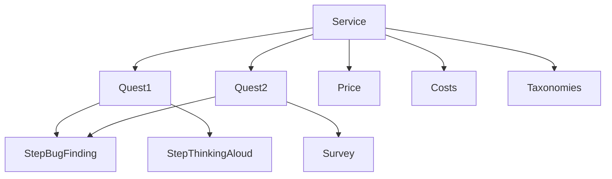
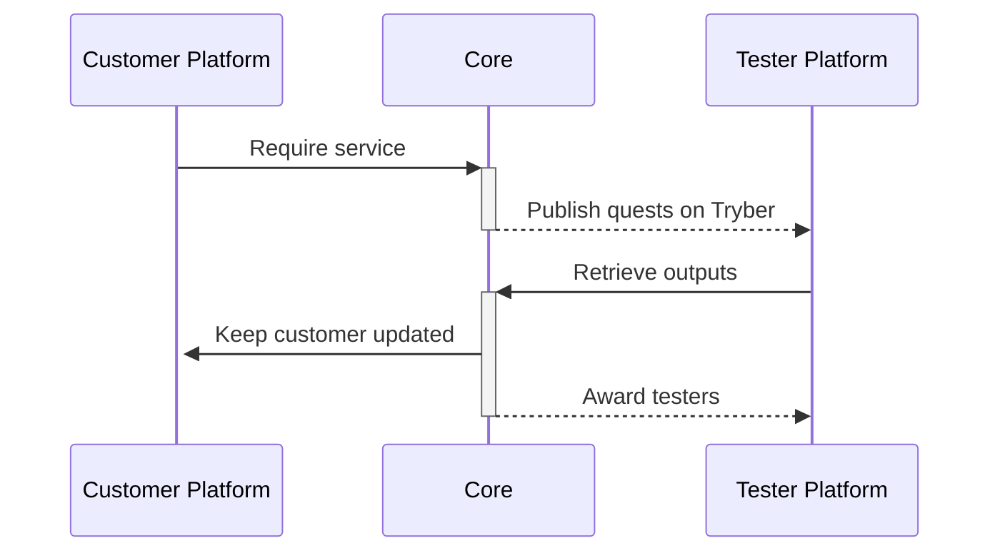

# UNGUESS CORE API - BLOCKS

Questo è il progetto iniziale per la definizione di un API di comunicazione tra i componenti del core di UNGUESS.

L'obiettivo è quello di definire una serie di blocchi che possono essere utilizzati per costruire i servizi di UNGUESS. Ogni servizio potrà contare su un numero variabile di blocchi permettendoci di adattarci ad ogni necessità.

I blocchi base ma non unici che costituiscono un servizio sono:

- Blocco [Quests](#quests): Elenco di missioni da svolgere, richiede il rispetto di determinate condizioni di accesso per poterne prendere parte.
- Blocco [Costs](#costs): Elenco di blocchi di costo che possono essere automaticamente calcolati dal sistema (es: determinato dalle quests) o inserito a mano dall'utente (es: campagna pubblicitaria facebook, costo in giornate del csm).
- Blocco [Price](#price): Prezzo del servizio.
- Blocco [Taxonomies](#taxonomies): Elenco di taxonomie che possono essere utilizzate per raggruppare un servizio. Non ha impatto sull'esecuzione del servizio, ma è utile solo a fini statistici.

## Quests
E' l'elemendo fondamentale del servizio, corrisponde all'attività che si vuole completare ed è formata da un elenco di blocchettini di tipo [Step](#step). 

Prevede una serie di condizioni di accesso che determinano la partecipazione del tester e l'impatto sul costo del servizio e un numero atteso di output obiettivo (esempio: numero di tester con completamento della missione).

### Condizioni di accesso alla quest
Consiste in un elenco di condizioni che devono essere soddisfatte per poter prendere parte alla quest. In questo modo il tester che soddisfa questi requisiti può in autonomia decidere se svolgere o meno la quest. Tutte le ulteriori logiche di ingaggio sono gestite direttamente dalla piattaforma dei tester che potrà estendere queste condizioni.

> ESEMPIO: QUEST RAPIDA
> 
> La piattaforma dei tester potrò decidere di auto-eliminare la partecipazione di un tester se non viene completata entro un certo tempo. In questo modo verrà liberato un posto che potrà essere occupato da un altro tester con le medesime caratteristiche. Il tutto senza influenzare la piattaforma customer o quella core.

Le regole di accesso inizialmente disponibili saranno:
- TimedAccessCondition: La quest è accessibile solo per un determinato periodo di tempo.
- TesterListAccessCondition: La quest è accessibile solo per una lista di tester specifica.
- TesterDeviceAccessCondition: La quest è accessibile solo per un certo tipo di dispositivo.
- TesterLimitAccessCondition: La quest è accessibile solo per un certo numero di tester.

### Step
Il blocco di tipo [Step](#step) è una singola attività da svolgere con uno specifico output. Inizialmente sono previste tre tipologie di step:
- BugForm Step
- Survey Step
- Media Step

## Costs
TBD

## Price
TBD

## Taxonomies
TBD

## Description
TBD STRAPI DOC

---

